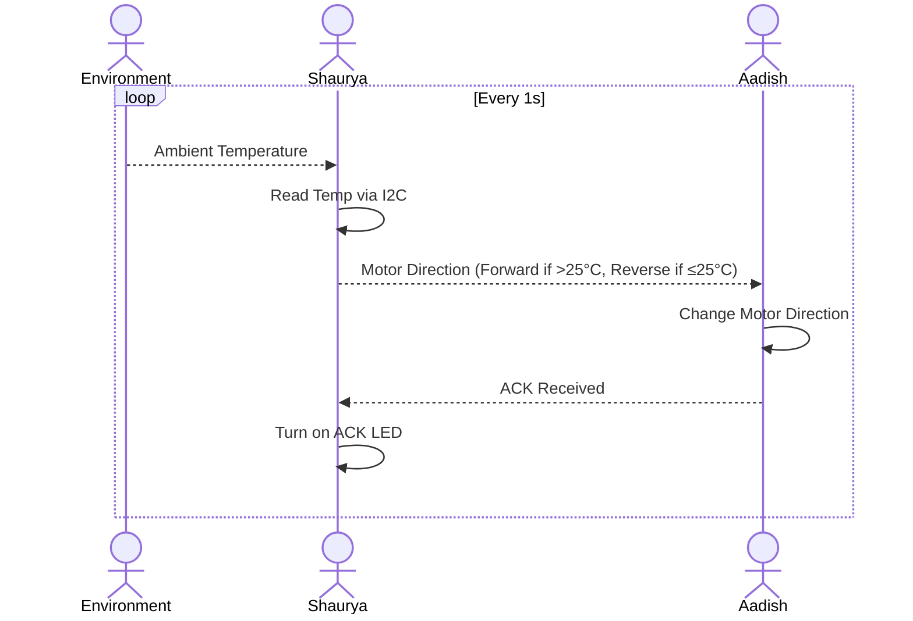

## Block Diagram


# Explaination:   

As Team 309A in the EGR314 course, our project goal was to demonstrate modularity, sensor-actuator interaction, and the use of standard communication protocols. We structured the block diagram to reflect a clear division between sensing and actuation, each handled by custom-built PCBs developed by different team members.

- Shaurya’s PCB integrates a temperature sensor with the PIC18F27Q10 microcontroller via I2C, enabling precise temperature readings with minimal wiring complexity.

- Aadish’s PCB features a PIC18F47Q10 microcontroller that interfaces with the IFX9201SGAUMA1 motor driver via SPI, allowing fast, reliable motor control.

- Inter-PCB communication is handled via UART, with TX and RX lines routed through pin 2 of our ribbon cable headers, satisfying the product requirement for UART-based data exchange between subsystems.

- The ribbon cable simplifies physical connectivity, aligning both power and communication signals for ease of use and testing.

This block structure meets all outlined requirements:

- SPI for motor control.

- I2C for sensor reading.

- UART between PCBs.

-Shared PIC microcontroller family.

- One sensor (temperature) and one actuator (motor).

- Compact and modular design using ribbon cables.


By designing a structured and readable block diagram, we ensured clarity in system functionality and adherence to modular design principles.  


## Connector Diagram


### General System

```
[Shaurya (Temp Sensor)] → UART → [Aadish (Motor Driver)]
                                    ↑
                            UART ACK ← LED On
```

- Shaurya uses the **AHT21** I2C temperature sensor.
- Aadish uses the **IFX9201SGAUMA1** H-Bridge motor driver.
- UART is used for all communication between the two.

---

## Process Diagram


### Explaination
Our communication sequence diagram outlines the real-time interaction between the sensor and actuator subsystems:   

- Temperature Reading: The PIC18F27Q10 on Shaurya's PCB reads the temperature sensor using I2C.
  
- Data Transmission: The temperature value is processed and transmitted via UART to Aadish's PCB.
  
- Motor Response: Upon receiving the temperature data, the PIC18F47Q10 interprets it and sends SPI commands to the motor driver, adjusting the motor’s speed or direction.
  
- Feedback Signal (Optional): A confirmation or status signal can be sent back over UART to verify correct action.   

This satisfies user needs by creating a system that is:   

- Interactive: Motor behavior dynamically reflects real-time environmental data.
  
- Modular: Communication between independent subsystems is clearly defined.
  
- Scalable: The message structure and sequence allow for additional features like acknowledgments or error handling.
  
- The functional sequence supports intuitive behavior (e.g., motor speeding up in response to rising temperature), making it understandable and meaningful for both users and evaluators.
  
---

## Message Structure

### IDs

| ID | User     |
|----|----------|
| 0xFC  | Shaurya  |
| 0xFD  | Aadish   |

---

### Message Types

**Type 1 – Motor Direction Command (Sent from Shaurya to Aadish)**

| Condition           | Message ID | Meaning        |
|---------------------|------------|----------------|
| Temp ≤ 25°C         | 0x01       | Motor Forward  |
| 25°C < Temp ≤ 30°C  | 0x02       | Motor Reverse  |
| Temp > 30°C         | 0x03       | Motor Off      |

**Type 2 – Acknowledgment (Sent from Aadish to Shaurya)**

| Message ID | Meaning                                  |
|------------|-------------------------------------------|
| 0x01       | Motor Forward Confirmation – Blink RB0    |
| 0x02       | Motor Reverse Confirmation – Blink RB4    |
| 0x03       | Motor Off Confirmation – Blink RB0 & RB4  |

---

### Serial Message Format

| Field        | Example (Motor Forward) |
|--------------|--------------------------|
| Prefix       | FS                       |
| Sender ID    | S                        |
| Receiver ID  | A                        |
| Data         | 01 (Forward)             |
| Suffix       | FS                       |

---

### Example Message Flow

#### If temperature is  greater than 25°C and less than 30°C:
- Shaurya sends: `FS`, `S`, `A`, `0x02`, `FS`
- Aadish sets motor direction **forward**
- Aadish replies: `FS`, `A`, `S`, `0x02`, `FS`
- Shaurya turns on LED to confirm ACK

#### If temperature is less than 25°C:
- Shaurya sends: `FS`, `S`, `A`, `0x01`, `FS`
- Aadish sets motor direction **reverse**
- Aadish replies with ACK and LED lights up

#### If temperature is above 30°C:
- Shaurya sends: `FS`, `S`, `A`, `0x03`, `FS`
- Aadish sets motor direction **stop**
- Aadish replies with ACK and LED lights up

---

## Software Changes
Updated I2C Pin Configuration for New Temperature Sensor
Although we initially planned to use the TC74 temperature sensor, we replaced it with a different I2C-based temperature sensor (AHT21) due to communication issues. The only software change required was updating the SDA and SCL pin assignments in MPLAB X MCC (Classic) to match the new sensor’s wiring. The rest of the I2C configuration and data handling code remained unchanged.

Corrected SPI Chip Select (CS) Pin Handling for Motor Driver
We modified the SPI motor control code to ensure the Chip Select (CS) pin is actively pulled Low before any SPI transaction with the IFX9201SGAUMA1 motor driver. This was done by explicitly setting the CS pin Low before SPI commands and setting it High afterward, ensuring consistent and reliable communication.

Switched from MCC Melody to MCC Classic for Peripheral Configuration
We transitioned from MCC Melody to MCC Classic for configuring I2C and SPI peripherals. MCC Classic provided more direct control over pin assignments and register-level settings, which allowed for a more stable and customizable software setup, especially for I2C communication.

Refined UART Message Protocol with Command Byte Mapping
We simplified the UART communication between microcontrollers by introducing fixed command bytes (e.g., 0x01 for forward, 0x02 for reverse, 0x03 for stop). This replaced the earlier format that transmitted raw or string-based data, reducing complexity on the motor control side.

Established Clear Temperature-to-Command Logic
We updated the software to map specific temperature ranges to motor commands. For example, when the temperature sensor reports values between 25–30°C, the motor moves forward. When the temperature reads below 25°C—triggered by a sensor board—the motor reverses. This mapping made the system behavior consistent and predictable.


