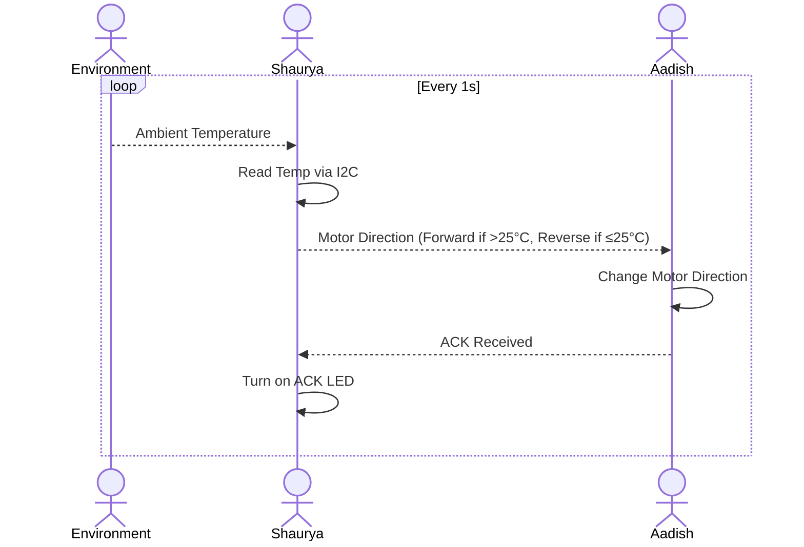

## Block Diagram

### General System

```
[Shaurya (Temp Sensor)] → UART → [Aadish (Motor Driver)]
                                    ↑
                            UART ACK ← LED On
```

- Shaurya uses the **TC74A4-3.3VCTTR** I2C temperature sensor.
- Aadish uses the **IFX9201SG** H-Bridge motor driver.
- UART is used for all communication between the two.

---

## Process Diagram



---

## Message Structure

### IDs

| ID | User     |
|----|----------|
| S  | Shaurya  |
| A  | Aadish   |

---

### Message Types

| Type ID | Description             |
|---------|-------------------------|
| 1       | Motor Direction Command |
| 2       | Acknowledgement (ACK)   |

---

### Message Variations

| Type | Meaning            | Message ID |
|------|--------------------|------------|
| 1    | Motor Forward       | 0x0040     |
| 1    | Motor Reverse       | 0x0041     |
| 2    | ACK                 | 0x00AF     |

---

### Serial Message Format (8 Bytes Total)

| Byte #   | Purpose             | Example Value         |
|----------|---------------------|------------------------|
| 1–2      | Prefix              | `AZ`                  |
| 3        | Sender ID           | `S` or `A`            |
| 4        | Receiver ID         | `A` or `S`            |
| 5–6      | Data (message ID)   | e.g., `0x0040`        |
| 7–8      | Suffix              | `YB`                  |

---

### Example Message Flow

#### If temperature is 28°C:
- Shaurya sends: `AZ`, `S`, `A`, `0x0040`, `YB`
- Aadish sets motor direction **forward**
- Aadish replies: `AZ`, `A`, `S`, `0x00AF`, `YB`
- Shaurya turns on LED to confirm ACK

#### If temperature is 20°C:
- Shaurya sends: `AZ`, `S`, `A`, `0x0041`, `YB`
- Aadish sets motor direction **reverse**
- Aadish replies with ACK and LED lights up

---
