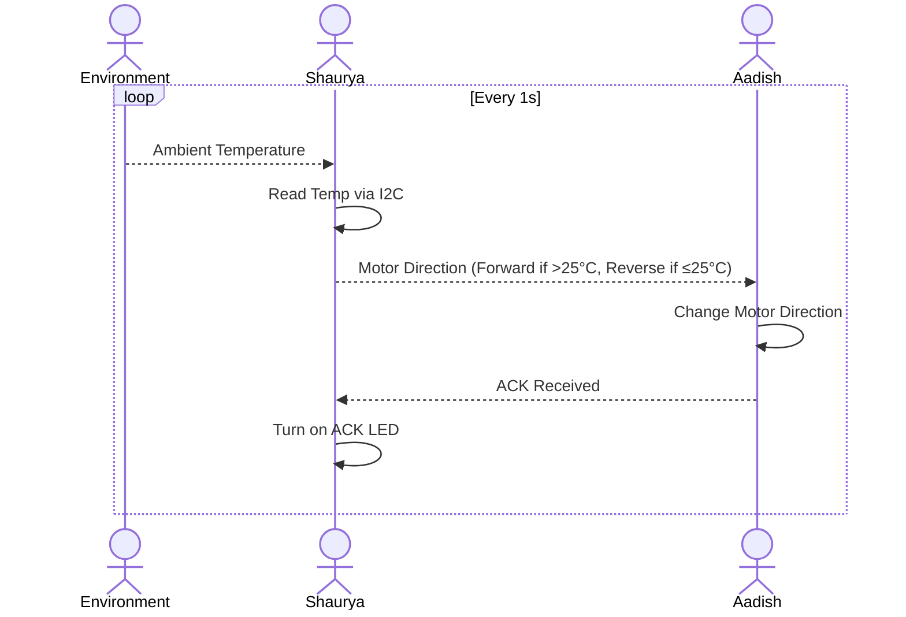

## Block Diagram


# Explaination:   
As Team 309A in the EGR314 course, our project goal was to demonstrate modularity, sensor-actuator interaction, and the use of standard communication protocols. We structured the block diagram to reflect a clear division between sensing and actuation, each handled by custom-built PCBs developed by different team members.  
+Shaurya’s PCB integrates a temperature sensor with the PIC18F27Q10 microcontroller via I2C, enabling precise temperature readings with minimal wiring complexity.  
+Aadish’s PCB features a PIC18F47Q10 microcontroller that interfaces with the IFX9201SGAUMA1 motor driver via SPI, allowing fast, reliable motor control.  
+Inter-PCB communication is handled via UART, with TX and RX lines routed through pin 2 of our ribbon cable headers, satisfying the product requirement for UART-based data exchange between subsystems.  
+The ribbon cable simplifies physical connectivity, aligning both power and communication signals for ease of use and testing.  

This block structure meets all outlined requirements:   
+SPI for motor control.   
+I2C for sensor reading.   
+UART between PCBs.   
+Shared PIC microcontroller family.   
+One sensor (temperature) and one actuator (motor).   
+Compact and modular design using ribbon cables.  


By designing a structured and readable block diagram, we ensured clarity in system functionality and adherence to modular design principles.  


## Connector Diagram


### General System

```
[Shaurya (Temp Sensor)] → UART → [Aadish (Motor Driver)]
                                    ↑
                            UART ACK ← LED On
```

- Shaurya uses the **TC74A4-3.3VCTTR** I2C temperature sensor.
- Aadish uses the **IFX9201SG** H-Bridge motor driver.
- UART is used for all communication between the two.

---

## Process Diagram


### Explaination
Our communication sequence diagram outlines the real-time interaction between the sensor and actuator subsystems:   
- Temperature Reading: The PIC18F27Q10 on Shaurya's PCB reads the temperature sensor using I2C.   
- Data Transmission: The temperature value is processed and transmitted via UART to Aadish's PCB.   
- Motor Response: Upon receiving the temperature data, the PIC18F47Q10 interprets it and sends SPI commands to the motor driver, adjusting the motor’s speed or direction.   
- Feedback Signal (Optional): A confirmation or status signal can be sent back over UART to verify correct action.   

This satisfies user needs by creating a system that is:   
- Interactive: Motor behavior dynamically reflects real-time environmental data.   
- Modular: Communication between independent subsystems is clearly defined.  
- Scalable: The message structure and sequence allow for additional features like acknowledgments or error handling.  
- The functional sequence supports intuitive behavior (e.g., motor speeding up in response to rising temperature), making it understandable and meaningful for both users and evaluators.  
---

## Message Structure

### IDs

| ID | User     |
|----|----------|
| S  | Shaurya  |
| A  | Aadish   |

---

### Message Types

| Type ID | Description             |
|---------|-------------------------|
| 1       | Motor Direction Command |
| 2       | Acknowledgement (ACK)   |

---

### Message Variations

| Type | Meaning            | Message ID |
|------|--------------------|------------|
| 1    | Motor Forward       | 0x0040     |
| 1    | Motor Reverse       | 0x0041     |
| 2    | ACK                 | 0x00AF     |

---

### Serial Message Format (8 Bytes Total)

| Byte #   | Purpose             | Example Value         |
|----------|---------------------|------------------------|
| 1–2      | Prefix              | `AZ`                  |
| 3        | Sender ID           | `S` or `A`            |
| 4        | Receiver ID         | `A` or `S`            |
| 5–6      | Data (message ID)   | e.g., `0x0040`        |
| 7–8      | Suffix              | `YB`                  |

---

### Example Message Flow

#### If temperature is  greater than 25°C and less than 30°C:
- Shaurya sends: `AZ`, `S`, `A`, `0x0040`, `YB`
- Aadish sets motor direction **forward**
- Aadish replies: `AZ`, `A`, `S`, `0x00AF`, `YB`
- Shaurya turns on LED to confirm ACK

#### If temperature is less than 25°C:
- Shaurya sends: `AZ`, `S`, `A`, `0x0041`, `YB`
- Aadish sets motor direction **reverse**
- Aadish replies with ACK and LED lights up

#### If temperature is above 30°C:
- Shaurya sends: `AZ`, `S`, `A`, `0x0041`, `YB`
- Aadish sets motor direction **stop**
- Aadish replies with ACK and LED lights up

---

## Software Challenges:
1. I2C Communication Failure with the Temperature Sensor PCB
In early testing, we discovered that I2C communication between the PIC18F27Q10 microcontroller and the TC74 temperature sensor was unreliable or completely unresponsive. After multiple debugging attempts—including checking pull-up resistors, signal integrity, and addressing—we identified that the sensor was not properly recognizing the PIC18F27Q10. This issue stemmed from internal sensor bugs or timing mismatches. We resolved the problem by simulating temperature values in software and sending those over UART instead. This maintained the sensor-actuator interaction as originally intended while avoiding the hardware conflict.

2. SPI Motor Driver Chip Select Pin Misconfiguration
Another major issue arose with the SPI interface between the PIC18F47Q10 and the IFX9201SGAUMA1 motor driver. The Chip Select (CS) pin was mistakenly initialized as High at system startup. This caused failed communication or unpredictable motor responses. In SPI communication, the CS pin needs to be Low to initiate a valid transaction. After discovering this, we modified the code to explicitly set CS Low before any SPI initialization or motor command sequence. This small yet critical change restored correct functionality and motor responsiveness.

3. Incorrect Use of MCC Melody for I2C Setup
Our initial software plan involved using MCC Melody to configure all peripherals, including I2C. However, after days of non-functional communication, we realized that MCC Melody did not properly configure I2C on the PIC18F27Q10 for our needs. The interrupt handling and register settings were incomplete or incompatible. We switched to MCC Classic, which allowed manual control over I2C parameters and interrupt behavior. After regenerating the code in MCC Classic and rewriting the I2C ISR structure, communication stabilized and behaved predictably.

4. Redefining Address-Based Motor Commands
To simplify the motor control logic on the receiving PCB, we restructured our UART message format to include specific numeric address codes that mapped directly to motor commands. Instead of sending raw temperature values or text commands, we began sending structured bytes like 0x01 for forward motion, 0x02 for reverse motion, and 0x03 for idle state. This approach reduced parsing complexity and improved reliability, especially during UART transmission. It also allowed us to easily modify or extend motor behavior by simply adding new address-function mappings.

5. Logic Errors in Temperature-to-Motor Mapping
Initially, the motor speed/direction logic based on temperature values was inconsistent. In some cases, low temperatures were incorrectly triggering high-speed motor commands. This happened because we had no defined temperature thresholds or ranges. We corrected this by introducing clear boundaries: e.g., temperatures 72–75°C mapped to one motor state, while 86–92°C (triggered by button press) mapped to another. This structured mapping ensured the motor behavior matched the sensor data and provided a reliable user experience.


